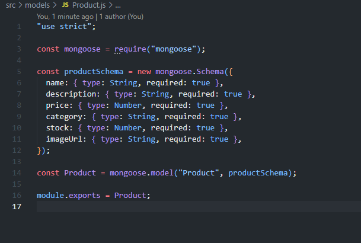

# Instructions
## Part 1: Set Up the Project
### Initialize the Project and Install Dependencies:

mkdir coffee-shop-backend
cd coffee-shop-backend
npm init -y  
  

npm install express mongoose  
  

### Set Up the Server:

// index.js
const express = require('express');
const mongoose = require('mongoose');
const app = express();
const port = 3000;

// Middleware to parse JSON bodies
app.use(express.json());

// Connect to MongoDB
mongoose
  .connect('your-mongodb-connection-string-here', {
    useNewUrlParser: true,
    useUnifiedTopology: true,
  })
  .then(() => {
    console.log('Connected to MongoDB');
  })
  .catch((error) => {
    console.error('Error connecting to MongoDB:', error);
  });

app.listen(port, () => {
  console.log(`Server is running at http://localhost:${port}`);
});  
  
  
  

## Part 2: Define the Product Model
### Create the Product Schema and Model:

// models/Product.js
const mongoose = require('mongoose');

const productSchema = new mongoose.Schema({
  name: {
    type: String,
    required: true,
  },
  description: {
    type: String,
    required: true,
  },
  price: {
    type: Number,
    required: true,
  },
  category: {
    type: String,
    required: true,
  },
  stock: {
    type: Number,
    required: true,
  },
  imageUrl: {
    type: String,
    required: true,
  },
});

const Product = mongoose.model('Product', productSchema);

module.exports = Product;  
  
  
  
## Part 3: Implement Basic CRUD Operations
### Set Up the Routes:

// routes/products.js
const express = require('express');
const router = express.Router();
const Product = require('../models/Product');

// Create a new product
router.post('/', async (req, res) => {
  try {
    const product = new Product(req.body);
    await product.save();
    res.status(201).json(product);
  } catch (error) {
    res.status(400).json({ error: error.message });
  }
});

// Get all products
router.get('/', async (req, res) => {
  try {
    const products = await Product.find();
    res.json(products);
  } catch (error) {
    res.status(500).json({ error: error.message });
  }
});

// Get a single product by ID
router.get('/:id', async (req, res) => {
  try {
    const product = await Product.findById(req.params.id);
    if (!product) {
      return res.status(404).json({ error: 'Product not found' });
    }
    res.json(product);
  } catch (error) {
    res.status(500).json({ error: error.message });
  }
});

// Update a product by ID
router.put('/:id', async (req, res) => {
  try {
    const product = await Product.findByIdAndUpdate(
      req.params.id,
      req.body,
      { new: true, runValidators: true }
    );
    if (!product) {
      return res.status(404).json({ error: 'Product not found' });
    }
    res.json(product);
  } catch (error) {
    res.status(400).json({ error: error.message });
  }
});

// Delete a product by ID
router.delete('/:id', async (req, res) => {
  try {
    const product = await Product.findByIdAndDelete(req.params.id);
    if (!product) {
      return res.status(404).json({ error: 'Product not found' });
    }
    res.json({ message: 'Product deleted successfully' });
  } catch (error) {
    res.status(500).json({ error: error.message });
  }
});

module.exports = router;

### Integrate the Routes with the Server:

// index.js
const express = require('express');
const mongoose = require('mongoose');
const productRoutes = require('./routes/products');
const app = express();
const port = 3000;

// Middleware to parse JSON bodies
app.use(express.json());

// Connect to MongoDB
mongoose
  .connect('your-mongodb-connection-string-here', {
    useNewUrlParser: true,
    useUnifiedTopology: true,
  })
  .then(() => {
    console.log('Connected to MongoDB');
  })
  .catch((error) => {
    console.error('Error connecting to MongoDB:', error);
  });

// Use the product routes
app.use('/products', productRoutes);

app.listen(port, () => {
  console.log(`Server is running at http://localhost:${port}`);
});

## Part 4: Test the API
### Start Your Server:

npm run dev
Test with Thunder Client or Postman:

### Create a Product:

Method: POST
URL: http://localhost:3000/products
Body: JSON
{
  "name": "Coffee Mug",
  "description": "A large coffee mug.",
  "price": 12.99,
  "category": "mugs",
  "stock": 100,
  "imageUrl": "http://example.com/mug.jpg"
}
Screenshot the POST request and response.  
  

### Get All Products:

Method: GET
URL: http://localhost:3000/products
Screenshot the GET request and response.  
  

### Get a Single Product by ID:

Method: GET
URL: http://localhost:3000/products/<product_id>
Screenshot the GET request and response.  
  

### Update a Product by ID:

Method: PUT
URL: http://localhost:3000/products/<product_id>
Body: JSON
{
  "name": "Large Coffee Mug",
  "description": "A large coffee mug, perfect for your morning coffee.",
  "price": 14.99,
  "category": "mugs",
  "stock": 50,
  "imageUrl": "http://example.com/mug.jpg"
}

Screenshot the PUT request and response.  
  

### Delete a Product by ID:

Method: DELETE
URL: http://localhost:3000/products/<product_id>

Screenshot the DELETE request and response.  
  

# Submission
## GitHub Repository: 
Create a new repository named coffee-shop-backend. Push your project to the repository and submit the URL. Ensure it includes all necessary files to run the server, including the README.md.

## Screenshots: 
Include the screenshots of your POST, GET, PUT, and DELETE requests in the README.md.